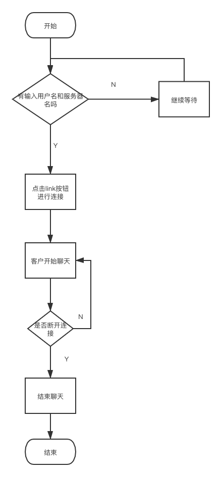

# 6-fyne-chat


# Go技术文档-聊天服务

## 1.整体框架

使用fyne开发聊天客户端，连接 第5题的聊天服务。

主要功能：

1）连接管理：连接、断开、展示连接状态（连接、断开，基于心跳包判断）

2）展示用户列表

3）发送消息

4）展示收到的消息

## 2.目录结构

```
.
├── README.md
├── clientGUI.png #流程图
├── controller
│   └── handle.go
├── go.mod
├── go.sum
├── log
│   └── info.log
├── main.go
├── model
│   ├── connect.pb.go
│   ├── connect.proto
│   └── message.go
├── picture
│   ├── one.png
│   ├── three.png
│   └── two.png
└── view
    └── view.go


```


## 3.代码逻辑分层

​	

| 层           | 文件夹      | 主要职责     | 调用关系     | 其他说明 |
| ------------ | ----------- | ------------ | ------------ | -------- |
| 应用层       | /main.go    | 程序启动     | 调用view层   |          |
| controller层 | /controller | 管理客户读写 | view层       |          |
| log层        | /log        | 输出日志     |              |          |
| picture      | /picture    | 存放图片     |              |          |
| model层      | /model      | 消息传送格式 | controller层 |          |


## 4.存储设计

数据存储信息

```
syntax = "proto3";
package com;

option go_package="../Protobuf;Protobuf";

message Communication{
  string Type = 1;
  string Msg = 2 ;
  string  Username=3;
  repeated string Userlist=4;
  string  IP =5;
}

```

```
用户名临时存储
type User struct {
	UserName string
}
```


## 5.接口设计

### 1.用户登录

### 	请求方式

​		websocket

### 	接口地址

​		ws:请求地质 ws://localhost:8080//ws

1. talk类型

   ```
   {
   	 Type = "1";
      Msg： "来啦来啦" ;
      Username：“alms”;
   }
   ```

2. Exit类型

   ```
   {
   	 Type = "2";
      Msg："" ;
      Username：“alms”;
   }
   ```

3. Userlist类型

   ```
   {
   	 Type = "3";
      Msg："" ;
   }
   ```

   ### 

## 6.第三方库

```
gorilla/websocket Go语言版websocket实现

go get fyne.io/fyne/v2 #绘制客户端
```

## 7.如何编译执行

### 代码格式化

```
make fmt
```

### 代码静态检测

```
make vet
```




